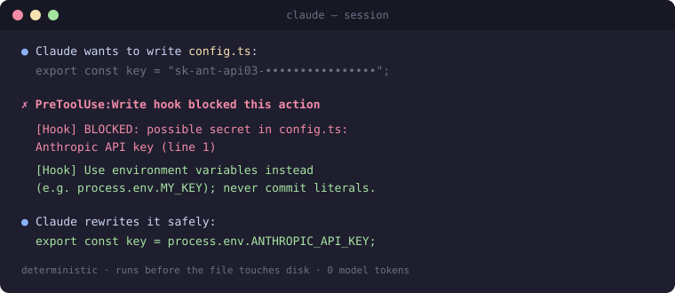

# Everything Claude Code — Lean

[](https://github.com/OsamaA140/everything-claude-code-lean/actions/workflows/tests.yml)

Production-ready agents, skills, hooks, commands, and rules for Claude Code — a **token-optimized fork** of [affaan-m/everything-claude-code](https://github.com/affaan-m/everything-claude-code) that keeps the coverage and cuts the cost.

## Why this fork: it barely costs tokens

Most plugin stacks quietly tax every session and every invocation. This one doesn't:

Measured, not claimed — full methodology and reproduction steps in [docs/BENCHMARK.md](docs/BENCHMARK.md):

| | This fork | Upstream ECC (measured @ e4e4163) |
|---|---|---|
| Always-on context cost | **~1,260 tokens** for all 26 skills + 9 agents | ~93,000 tokens for a full checkout |
| Avg agent invocation | **623 tokens** | 1,605 tokens (**61% less**) |
| Avg skill invocation | **455 tokens** | 2,203 tokens (**79% less**) |
| Avg command invocation | **189 tokens** | 970 tokens (**81% less**) |
| Hooks (secret blocking, command guard, formatting) | **0 tokens** — they run in the harness, not the model | 0 (same mechanism) |
| Verification | 100/100 unit tests, CI on Node 20/22, guards live-fired in real sessions | — |

(Fair-comparison note: upstream is a marketplace meant to be partially enabled, and covers far more ground — the per-invocation averages are the like-for-like numbers. Details and caveats in the benchmark doc.)

How: agents/skills state *when and why*, not re-teach *how* (Claude already knows the syntax); commands are thin pointers to agents instead of duplicating them; execution agents run on Sonnet with Opus reserved for architecture, planning, and security; and all enforcement lives in zero-token hooks. Full change log in `OPTIMIZATION.md` and `CHANGELOG.md`.

### The secret-leak hook in action



*Rendered from a real session exchange — same text the hook produces live.*

## What's Inside

```
agents/      9 specialized subagents (planner, architect, tdd-guide, code-reviewer,
             security-reviewer, build-error-resolver, e2e-runner, refactor-cleaner, doc-updater)
skills/      Workflow/domain knowledge (coding-standards, backend/frontend-patterns,
             clickhouse-io, tdd-workflow, security-review, eval-harness, verification-loop,
             continuous-learning, strategic-compact, project-guidelines-example)
commands/    Slash commands (/plan /tdd /e2e /code-review /build-fix /refactor-clean
             /verify /checkpoint /eval /learn /orchestrate /setup-pm /test-coverage
             /update-codemaps /update-docs)
rules/       Always-follow guidelines — copy to ~/.claude/rules/
hooks/       hooks.json + memory-persistence and strategic-compact scripts
scripts/     Cross-platform Node.js hook implementations + package-manager detection
contexts/    Dynamic mode prompts (dev / research / review)
examples/    Example CLAUDE.md configs
mcp-configs/ Example MCP server configs (replace YOUR_*_HERE placeholders)
```

## Install

**As a plugin (recommended):**
```bash
/plugin marketplace add <path-or-repo-you-host-this-at>
/plugin install everything-claude-code@everything-claude-code
```

**Manual:**
```bash
cp agents/*.md ~/.claude/agents/
cp rules/*.md ~/.claude/rules/
cp commands/*.md ~/.claude/commands/
cp -r skills/* ~/.claude/skills/
# merge hooks/hooks.json into ~/.claude/settings.json
# copy desired entries from mcp-configs/mcp-servers.json into ~/.claude.json (fill in API keys)
```

**Requirements:** hooks and tests need **Node.js** on PATH. Every hook command is guarded with `command -v node || exit 0`, so on machines without Node the hooks silently no-op instead of erroring on every tool call (guard is POSIX shell — Windows users should strip the prefix or install Node). Agents, skills, commands, and rules work regardless.

## Hook Safety Engine

All hooks are harness-side (zero model-context cost) and live in `scripts/hooks/`, with shared rules in `scripts/lib/guards.js`:

- **pre-bash** — blocks destructive commands (`rm -rf /`, `curl | sh`, force-push to main, raw disk writes, fork bombs); warns on risky ones (`git reset --hard`, `git clean -f`, `--no-verify`); notes that dev servers are best run in the background.
- **pre-write** — blocks Writes/Edits that would introduce API keys, tokens, or private-key material (AWS, GitHub, Anthropic, OpenAI, Stripe, Slack, Google); placeholder- and template-aware. Also blocks stray `.md`/`.txt` creation outside sanctioned locations.
- **post-edit** — one process for Prettier, scoped `tsc`, and `console.log` warnings. Opt out per-check: `CLAUDE_HOOKS_DISABLE=tsc,prettier,consolelog`.
- **session-start / session-end** — cross-session memory: session end captures a git snapshot (branch, changed files, recent commits); session start injects previous-session notes and learned skills into model context via `additionalContext`.

Guard rules are unit-tested: `node tests/lib/guards.test.js` (26 cases).

## Key Concepts

**Agents** — subagents with scoped tools/model, invoked by name or proactively per their `description`. **Skills** — reference/workflow docs loaded on demand (progressive disclosure — cheap until triggered). **Commands** — slash-command entry points, usually thin wrappers that invoke an agent. **Rules** — always-on guidelines, kept modular and short since they load every session. **Hooks** — fire on tool lifecycle events (PreToolUse/PostToolUse/Stop/etc.), configured in `settings.json`.

## Customize
Put your own stack, conventions, and "never touch this" list in your project's `CLAUDE.md` and `skills/<your-project>/SKILL.md` (see `project-guidelines-example`). Everything here is generic on purpose — that's what keeps it cheap to run across any project.

## Context Window Hygiene
Don't enable every MCP at once — budget ~20-30 configured, <10 enabled per project, <80 active tools, or your effective context shrinks fast. Use `disabledMcpServers` to turn off what you're not using.

## Tests
```bash
node tests/run-all.js
```

## Credit & License
MIT, upstream by [Affaan Mustafa](https://x.com/affaanmustafa) — [original repo](https://github.com/affaan-m/everything-claude-code) (10+ months of production use, Anthropic x Forum Ventures hackathon winner). This fork only compresses/restructures for token efficiency; all credit for the underlying content and design goes upstream. Use freely, modify as needed.
